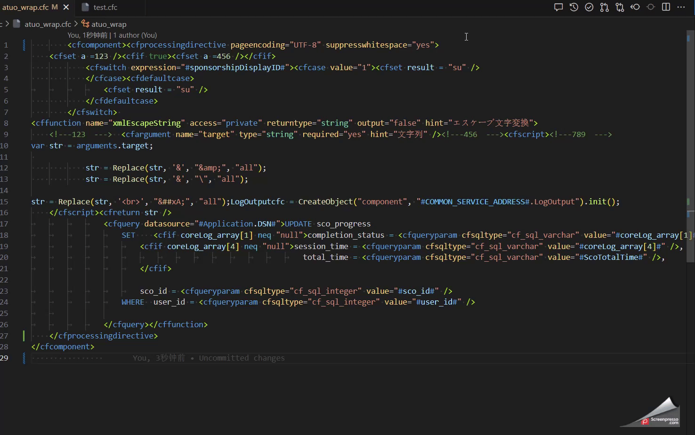
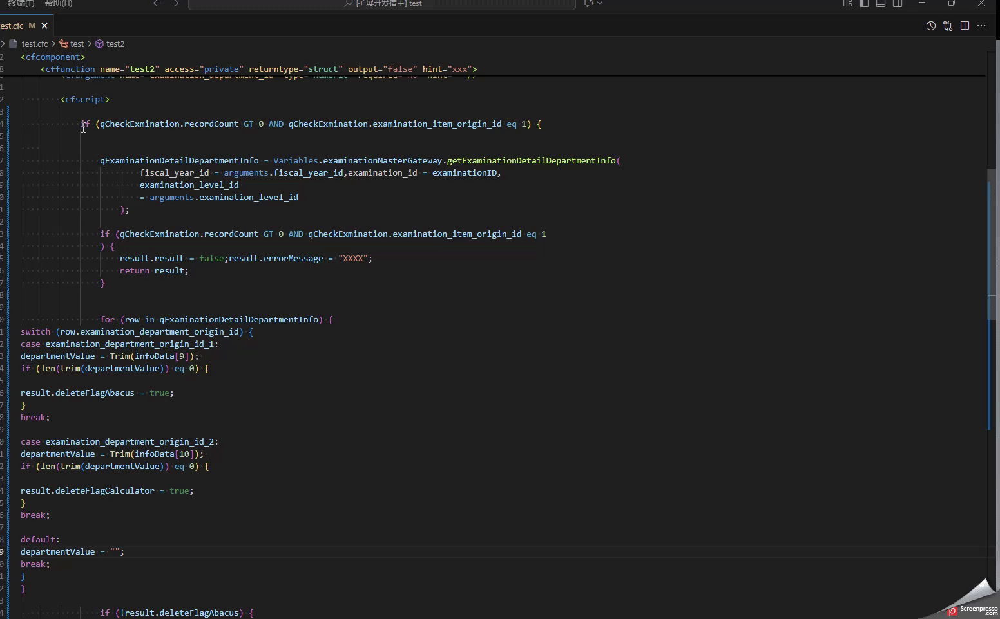

# 🐧🎈ᓚᘏᗢ    CFML Auto Formatter 

## 🏈 English

**CFML Code Auto-Formatting Extension** for VS Code.
This extension is **specialized in automatic tag wrapping** and **indent formatting**, without making unnecessary code style changes.

---

### Features

* **CFML (.cfc)** automatic indent formatting (stable operation)
* Automatic tag wrapping
* Partial formatting by block tags
* Preserves original code style
* Supports manual execution & automatic formatting on save

---

## Usage

1. Install the extension.
2. Open a CFML file (`.cfm` or `.cfc`).
3. Right-click and select **Format CFML (satt)**.
4. Choose from the available formatting options:

   - **CFTag Syntax**
     - Formats CFML tags (e.g., `<cfquery xxx>XXX</cfquery>`).
     - If no specific content is selected, formats the entire CFC file.

   - **Script Syntax**
     - Formats content within `<cfscript>` blocks.
     - Can also format embedded JavaScript.

   - **HTML Syntax**
     - Formats HTML tag content within `.cfm` files.

   - **CSS Syntax**
     - Formats CSS content within `.cfm` files.

---
### Notes

* `.cfc` file formatting operates stably
* `.cfm` files may have formatting issues → planned to improve in the future
* SQL statements should avoid <mark>leading commas</mark> <small>[why?](https://github.com/sql-formatter-org/sql-formatter/issues/899)</small>
* When formatting after focusing on the opening tag, the closing tag may be automatically added.
  This is an issue caused by another plugin (e.g. Auto Close Tag).
* SQL formatting is first done using **sql-formatter**.
  However, if it includes something particularly complex such as `cfloop`, my own custom logic is applied.
* The formatting of `cfscript` is very similar to JavaScript.
  If the string contains SQL statements, XML, or HTML tags, tags may break, so it’s better not to use it.
* Automatic tag wrapping is useful when a tag has many attributes, but short inline tags may also get wrapped.
* I have already tried using Lucee’s AST methods `astFromString()` and `astFromPath()`, but I couldn’t get detailed information from them. Below is the execution result I obtained, and I’m still experimenting with this. [See issue #20](https://github.com/satt-hri/vscode-plugin-cf-formatter/issues/20)

---

#### 1. Tag wrapping

  

#### 2. Partial formatting

| 2.1 CFTag Syntax | 2.2 Script Syntax |
| ---------------- | ----------------- |
|  |  |

#### 3. Indent formatting

  

---

### ⚙️ CFML Formatter Default Settings

| Setting                                                    | Default Value               | Type                   | Description                                                                           |
| ---------------------------------------------------------- | --------------------------- | ---------------------- | ------------------------------------------------------------------------------------- |
| <small>`hri.cfml.formatter.indentWithTabs`</small>         | <small>`true`</small>       | <small>boolean</small> | <small>Use tabs instead of spaces for indentation.</small>                            |
| <small>`hri.cfml.formatter.indentSize`</small>             | <small>`4`</small>          | <small>number</small>  | <small>Number of spaces when indenting with spaces (1–10).</small>                    |
| <small>`hri.cfml.formatter.indentChar`</small>             | <small>`" "`</small>        | <small>string</small>  | <small>Indent character: space `" "` or `\t`. Overridden by `indentWithTabs`.</small> |
| <small>`hri.cfml.formatter.wrapLineLength`</small>         | <small>`0`</small>          | <small>number</small>  | <small>Wrap lines after this many characters. `0` means no limit.</small>             |
| <small>`hri.cfml.formatter.maxPreserveNewlines`</small>    | <small>`2`</small>          | <small>number</small>  | <small>Maximum number of consecutive newlines to preserve (0–10).</small>             |
| <small>`hri.cfml.formatter.preserveNewlines`</small>       | <small>`true`</small>       | <small>boolean</small> | <small>Whether to preserve existing newlines.</small>                                 |
| <small>`hri.cfml.formatter.keepArrayIndentation`</small>   | <small>`false`</small>      | <small>boolean</small> | <small>Whether to preserve original array indentation.</small>                        |
| <small>`hri.cfml.formatter.braceStyle`</small>             | <small>`"collapse"`</small> | <small>string</small>  | <small>Brace style: `collapse` / `expand` / `end-expand` / `none`.</small>            |
| <small>`hri.cfml.formatter.breakChainedMethods`</small>    | <small>`false`</small>      | <small>boolean</small> | <small>Whether to break chained methods into multiple lines.</small>                  |
| <small>`hri.cfml.formatter.spaceBeforeConditional`</small> | <small>`true`</small>       | <small>boolean</small> | <small>Whether to add a space before conditionals (if, while, for).</small>           |
| <small>`hri.cfml.formatter.endWithNewline`</small>         | <small>`false`</small>      | <small>boolean</small> | <small>Whether to add a newline at the end of the file.</small>                       |
| <small>`hri.cfml.formatter.expressionWidth`</small>        | <small>`30`</small>         | <small>number</small>  | <small>Wrap lines when the SQL string length exceeds this value.</small>              |
| <small>`hri.cfml.formatter.sqlLanguage`</small>            | <small>`"mysql"`</small>    | <small>string</small>  | <small>Select SQL dialect for formatting.</small>                                     |

💡 **How to Change Settings**
Press **`Ctrl + ,`** in VSCode and enter **"Format CFML (satt)"** in the search box to make changes.
After modifying, don’t forget to reload the window!

---

## 👘 日本語

VS Code 用 **CFML コード自動整形拡張機能**。  
この拡張機能は **タグの自動改行**、**インデント整形に特化** しており、余計なコードスタイルの変更は行いません。

---

### 機能
- **CFML (.cfc)** コードの自動インデント整形（安定動作）
- タグの自動改行
- ブロックタグごとで部分的にフォーマット
- 元のコードスタイルを保持
- 手動実行 & 保存時自動整形に対応

---

### 使い方
1. 拡張機能をインストール
2. CFML ファイルを開く（`.cfm` または `.cfc`）
3. ショートカット **`Shift + Alt + M`** または右クリック → **`Format CFML (satt)` ドキュメントのフォーマット**
4. 利用可能なフォーマットオプションから選択:

   - **CFTag 構文**
     - CFML タグをフォーマットします（例: `<cfquery xxx>XXX</cfquery>`）。
     - コンテンツを選択していない場合、CFC ファイル全体をフォーマットします。

   - **Script 構文**
     - `<cfscript>` ブロック内のコンテンツをフォーマットします。
     - 埋め込まれた JavaScript もフォーマット可能です。

   - **HTML 構文**
     - `.cfm` ファイル内の HTML タグコンテンツをフォーマットします。

   - **CSS 構文**
     - `.cfm` ファイル内の CSS コンテンツをフォーマットします。

---

### 注意点
- `.cfc` ファイルの整形は安定動作  
- `.cfm` ファイルは整形が乱れる場合あり → 今後改善予定  
- SQL文は<mark>カンマ前置をしないように</mark> <small>[何故?](https://github.com/sql-formatter-org/sql-formatter/issues/899)
- 開始タグにフォーカスしてからフォーマットすると、自動で閉じタグが追加されてしまう場合がある。これは他のプラグインの問題である。例: (Auto Close Tag)
- SQL のフォーマットは、まず **sql-formatter** を使用します。ただし、`cfloop` など特に複雑なものを含む場合は、自作のロジックでフォーマットします。  
- `cfscript` のフォーマットは、JavaScript と非常に似ています。
   SQL 文や XML、HTML タグが含まれていると、タグが壊れることがあるので、使わないほうがいいです。
- タグの自動改行は属性が多い場合に便利ですが、インラインで短いタグを使いたいケースでは改行されることがあります。

---

### CFML フォーマッタ デフォルト設定

| 設定項目                                                   | デフォルト値                | 型                     | 説明                                                                                         |
| ---------------------------------------------------------- | --------------------------- | ---------------------- | -------------------------------------------------------------------------------------------- |
| <small>`hri.cfml.formatter.indentWithTabs`</small>         | <small>`true`</small>       | <small>boolean</small> | <small>インデントにスペースではなくタブを使用する。</small>                                  |
| <small>`hri.cfml.formatter.indentSize`</small>             | <small>`4`</small>          | <small>number</small>  | <small>スペースでインデントする場合のスペース数（1–10）。</small>                            |
| <small>`hri.cfml.formatter.indentChar`</small>             | <small>`" "`</small>        | <small>string</small>  | <small>インデント文字：スペース `" "` または `\t`。`indentWithTabs` で上書きされる。</small> |
| <small>`hri.cfml.formatter.wrapLineLength`</small>         | <small>`0`</small>          | <small>number</small>  | <small>この文字数を超えると改行。`0` は制限なし。</small>                                    |
| <small>`hri.cfml.formatter.maxPreserveNewlines`</small>    | <small>`2`</small>          | <small>number</small>  | <small>連続して保持する改行の最大数（0–10）。</small>                                        |
| <small>`hri.cfml.formatter.preserveNewlines`</small>       | <small>`true`</small>       | <small>boolean</small> | <small>既存の改行を保持するかどうか。</small>                                                |
| <small>`hri.cfml.formatter.keepArrayIndentation`</small>   | <small>`false`</small>      | <small>boolean</small> | <small>配列の元のインデントを保持するかどうか。</small>                                      |
| <small>`hri.cfml.formatter.braceStyle`</small>             | <small>`"collapse"`</small> | <small>string</small>  | <small>波括弧スタイル：`collapse` / `expand` / `end-expand` / `none`。</small>               |
| <small>`hri.cfml.formatter.breakChainedMethods`</small>    | <small>`false`</small>      | <small>boolean</small> | <small>メソッドチェーンを複数行に分割するかどうか。</small>                                  |
| <small>`hri.cfml.formatter.spaceBeforeConditional`</small> | <small>`true`</small>       | <small>boolean</small> | <small>条件文（if, while, for）の前にスペースを入れるか。</small>                            |
| <small>`hri.cfml.formatter.endWithNewline`</small>         | <small>`false`</small>      | <small>boolean</small> | <small>ファイル末尾に改行を追加するかどうか。</small>                                        |
| <small>`hri.cfml.formatter.expressionWidth`</small>        | <small>`30`</small>         | <small>number</small>  | <small>sql指定文字列長さを超えると改行</small>                                               |
| <small>`hri.cfml.formatter.sqlLanguage`</small>            | <small>`"mysql"`</small>    | <small>string</small>  | <small>フォーマットSQLを選ぶ</small>                                                         |

💡 **設定変更方法**  
VSCode で **`Ctrl + ,`** を押し、検索欄に **「Format CFML (satt)」** と入力すると変更可能。変更があったら、再起動みたいな操作でウィンドウをリロードするのを忘れないでね  

